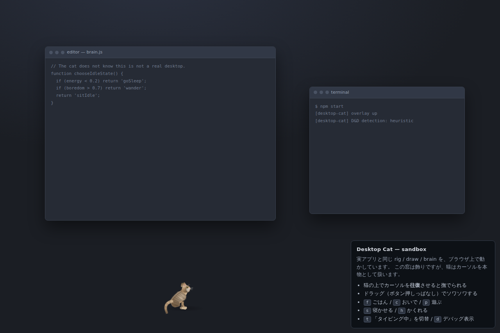

# Desktop Cat

デスクトップに常駐する猫。ウインドウの裏に消えたり、そこからこっちを伺ったり、
気が向いたらマウスカーソルに猫パンチしたりします。



Electron 製で、macOS / Windows / Linux で動きます。

---

## 何をするか

| 猫のふるまい | きっかけ |
| --- | --- |
| 座る・毛づくろい・伸びをする・うろつく・丸くなって寝る | 手持ちぶさたなとき |
| **画面の裏に消える** | ときどき。本当に `alwaysOnTop` を切って他のウインドウの下に潜ります |
| **ウインドウの端からこっちを伺う** | 隠れたあと。頭だけ出して、瞳孔を開いてカーソルを目で追います |
| **D&D中にめっちゃ見てソワソワする** | ドラッグ検出時。尻尾を激しく振り、体重を左右に移し、前足がピクつきます |
| **作業中に前にドカッと座る** | 一定時間タイピングし続けたとき。前面ウインドウの中央に来て香箱を組みます |
| **カーソルに猫パンチする** | 退屈していて、カーソルが近くで速く動いたとき（しのび足 → 飛びかかり → 猫パンチ） |
| **撫でられて満足すると、どっかいく** | 猫の体の上でカーソルを往復させたとき。満足すると去り、しばらく撫でさせません |
| **ご飯を食べてしばらく大人しくなる** | ごはんをあげたとき。完食後は約6分間、いたずらをしません |

猫には空腹・体力・退屈・愛着の4つの欲求があり、これが行動の選ばれ方を左右します。
欲求は終了時に保存されるので、起動するたびに腹ペコで生まれ直したりはしません。

## 使い方

```sh
cd desktop-cat
npm install
npm start
```

トレイアイコン（メニューバー / 通知領域）から操作します。

- **ごはんをあげる** — カーソル位置に器を置きます（`Ctrl`/`Cmd`+`Alt`+`F`）
- **おいで** / **遊ぶ** / **寝かせる** / **かくれる**
- **毛色** — 茶トラ / グレー / 黒 / クリーム
- **大きさ** — 小 / 中 / 大
- **猫をしまう** — 一時的に消します
- **終了**

**撫でるには、猫の体の上でカーソルを数回往復させてください。** クリックではありません
（後述の理由でクリックは受け取りません）。ただ通り過ぎるだけでは撫でたことになりません。

### ブラウザで試す

Electron を入れずに、同じ rig / brain をブラウザで動かせます。

```sh
npm run sandbox        # dev/sandbox.html を開く
```

偽のウインドウが並んだ模擬デスクトップ上に猫が出ます。`f` ごはん、`c` おいで、
`p` 遊ぶ、`s` 寝かせる、`h` かくれる、`t` タイピング中の切替、`d` デバッグ表示、
`k` 骨格の可視化。

## クリックを絶対に奪わない設計

オーバーレイは1枚の透過・枠なしウインドウで、ディスプレイの作業領域全体を覆います。
そして `setIgnoreMouseEvents(true, { forward: true })` で**入力を一切受け取りません**。

つまり猫はマウスイベントを受け取れません。だから「撫でる」は、カーソルの軌跡を見て
判定しています。副作用として、猫がどこにいてもあなたのクリックを邪魔しません。

「ウインドウの裏に行く」は2通りで実現しています。

1. **本当に潜る** — `alwaysOnTop` を切り、他のウインドウに覆われる状態にします。
2. **裏にいるように見せる** — 前面ウインドウと重なる部分のキャンバスを `clearRect` で
   消します。キャンバスは透過なので、消した部分には本物のウインドウが見え、
   猫がその後ろにいるように見えます。

前面ウインドウの位置は、プラットフォームごとに外部コマンドで取得します
（Windows: PowerShell + user32、macOS: `osascript`、Linux/X11: `xdotool` か
`xprop`+`xwininfo`）。取得できない場合は画面端に隠れる挙動にフォールバックします。
macOS ではアクセシビリティ権限が必要で、無ければ黙って画面端モードになります。

## センサーについて（何を見ていて、何を見ていないか）

- **タイピング判定** — `powerMonitor.getSystemIdleTime()` が「直近1秒に入力あり」を
  返し、かつポインタが止まっている場合をタイピング中とみなします。キーの内容は
  一切読んでいませんし、キーロギングもネイティブコードも使いません。
- **ドラッグ判定** — 既定では「一定時間の連続したカーソル移動」というヒューリスティック
  です。ドラッグや範囲選択とよく相関しますが、正確ではありません。

  厳密に判定したい場合は、グローバル入力フックを自分で入れてください。

  ```sh
  npm install uiohook-napi
  ```

  そのうえで `state.json`（下記）に `"nativeInputHook": true` を設定します。
  依存関係として宣言していないのは意図的です。libuiohook は `require()` が返った**後**に
  ネイティブ側から例外を投げることがあり、それは try/catch では捕まえられないため、
  既定インストールでは絶対に触らないようにしています。現在どちらで動いているかは
  トレイメニューの「D&D検出」に出ます。

## 設定ファイル

`state.json` に設定と猫の気分が入ります。場所は Electron の `userData`：

- macOS: `~/Library/Application Support/desktop-cat/state.json`
- Windows: `%APPDATA%\desktop-cat\state.json`
- Linux: `~/.config/desktop-cat/state.json`

| キー | 既定値 | 意味 |
| --- | --- | --- |
| `scale` | `0.95` | 猫の大きさ |
| `coat` | `brownTabby` | 毛色 |
| `dragHeuristic` | `true` | フックなしでのドラッグ推定を使う |
| `nativeInputHook` | `false` | `uiohook-napi` があれば使う |
| `followCursorAcrossDisplays` | `true` | カーソルが2秒以上他のモニタにいたら移動する |
| `hunger` / `energy` / `affection` | — | 保存された欲求値 |

## 中身

```
src/main/main.js          オーバーレイ、60Hzのセンサーループ、トレイ
src/main/sensors.js       タイピング / ドラッグ判定
src/main/window-probe.js  前面ウインドウの矩形取得（プラットフォーム別）
src/main/store.js         state.json の読み書き
src/main/preload.js       contextBridge（入力3つ、出力1つのみ）
src/renderer/rig.js       骨格・ばね物理・2ボーンIK・歩容
src/renderer/draw.js      Canvas 2D による手続き的な猫の描画
src/renderer/brain.js     欲求モデルと優先度割り込み型ステートマシン
src/renderer/app.js       描画ループと配線
```

絵はすべて手続き的に描いています（スプライト画像はありません）。

- 背骨は世界座標のばねで、腰より遅れて動くので走り出しと止まりに慣性が出ます
- 尻尾は11節のばね連鎖。目標形状を角度から先に組み立ててから追従させます
  （実位置を角度計算に戻すと、ばねが自分の誤差と結合して根元に折れが固定されます）
- 脚は2ボーンIK。接地中の足は世界座標に固定されるので足が滑りません
- 太ももは胴体より先に描きます。胴体に隠れてほしい部位なので、後から描くと
  折りたたんだ後脚が体の上に白い管として乗ります
- 頭は横向きと三分の二向きの2枚のシルエットを `headYaw` で補間しています。だから
  肩越しにこっちを見られます

`assets/poses.png` に主要な姿勢と毛色の一覧があります。

## 開発

```sh
npm test          # 行動の自動テスト（ヘッドレス、Electron不要）
npm run dev       # デバッグHUD付きで起動（--cat-skeleton で骨格も表示）
npm run shots     # dev/pose-sheet.png と dev/detail.png を再生成
npm run icons     # assets/ のアイコンを再生成
```

`npm test` は合成センサーで brain を駆動し、宣伝している各ふるまいが本当に発火するか
検証します（撫で・ドラッグ注視・作業妨害・給餌・隠れて覗く・猫パンチ、および
1時間ぶんのシミュレーション）。DOM に依存しないので画面なしで走ります。

配布ビルドは electron-builder を使います（依存には入れていません）。

```sh
npx electron-builder
```

## 既知の制限

- **ドラッグ判定は既定では推定**です。厳密にしたい場合は上記のフックを入れてください。
- **前面ウインドウの取得は best-effort** です。Linux では `xdotool` か `xwininfo` が
  必要で、macOS ではアクセシビリティ権限が必要です。取れない場合は画面端に隠れます。
- **マルチディスプレイは1画面ずつ**です。カーソルが2秒以上他のモニタにいると、
  オーバーレイがそちらに移り、猫は画面端から歩いて入ってきます。同時に複数画面には出ません。
- **全画面のゲームやアプリの上には出ないことがあります**。macOS では `panel` 型で
  全画面スペースの上に浮かせていますが、環境によります。
- ヘッドレスコンテナ上で開発・検証しているため、**実機のデスクトップでの
  最終確認は未実施**です。透過ウインドウの挙動と前面ウインドウ取得は
  デスクトップ環境ごとの差が出やすい部分なので、実機で試して詰まったら教えてください。

## ライセンス

MIT
